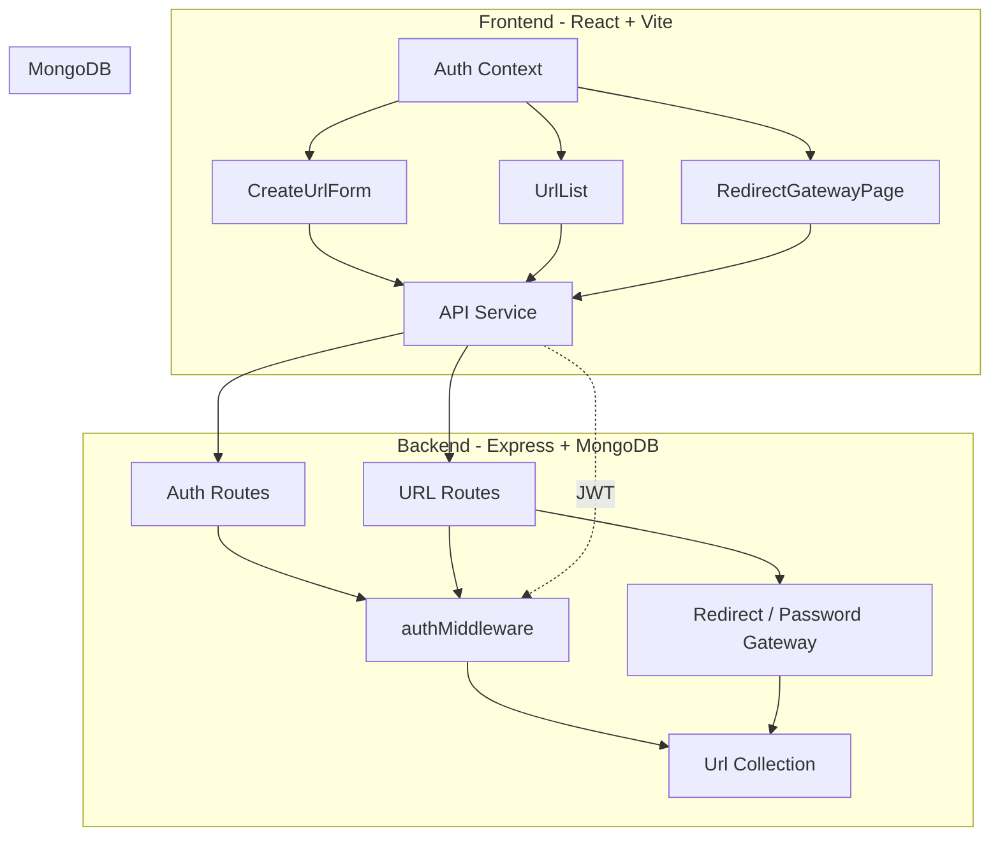
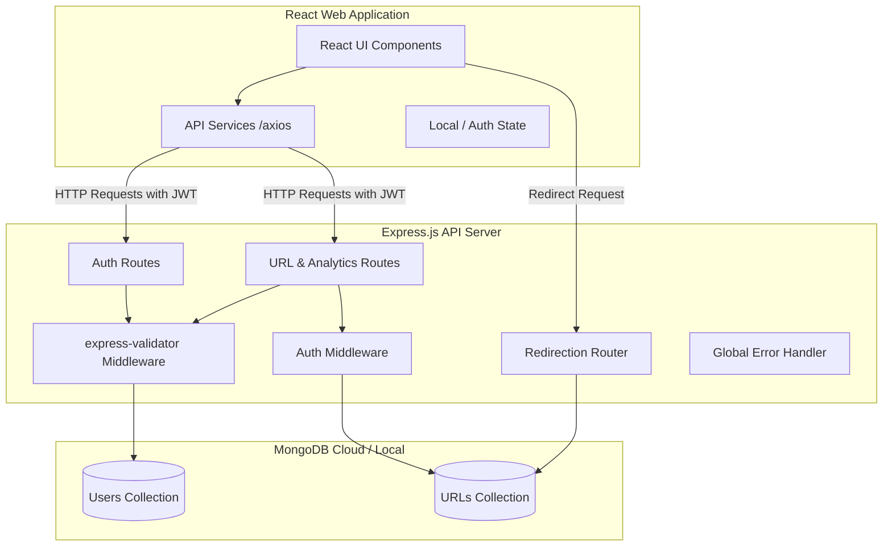

# Premium URL Shortener - AI Planning Document & README

This is a premium, full-stack URL Shortener application built using React for the frontend, Node.js and Express.js for the backend, and MongoDB (with Mongoose) for the database. It features JWT-based authentication, click analytics, secure password-protected redirects, bulk URL import, and a responsive dashboard UI.

## 1. Setup Instructions

### Backend Setup
1. Open a terminal in `backend/`.
2. Run `npm install`.
3. Create a `.env` file with these values:
   - `MONGODB_URI=<your MongoDB connection string>`
   - `JWT_SECRET=<your jwt secret>`
   - `FRONTEND_URL=http://localhost:5173`
4. Start the backend server:
   - `npm run dev`
   - The backend runs by default on `http://localhost:5000`.

### Frontend Setup
1. Open a terminal in `frontend/`.
2. Run `npm install`.
3. Create a `.env` file with this value:
   - `VITE_API_URL=http://localhost:5000`
4. Start the frontend app:
   - `npm run dev`
   - The frontend runs by default on `http://localhost:5173`.

### Local Development Workflow
- Start backend first, then frontend.
- Open the browser to `http://localhost:5173` to access the application.
- Use the signup page to create a new account, then log in and manage URL short links.

### Backend Testing with Postman
- Recommended: use Postman to test backend endpoints before using the frontend.
- Create requests for `/api/auth/signup`, `/api/auth/login`, `/api/urls`, `/api/urls/bulk`, `/api/urls/:id`, `/api/urls/:shortCode/analytics`, and `/api/redirect/:shortCode/verify`.
- Send `Authorization: Bearer <token>` for protected routes.
- If you have a Postman collection, include it with your submission.

## 2. Assumptions Made

- The app is intended for authenticated users only to manage their own links.
- MongoDB is available and reachable using `MONGODB_URI`.
- JWT secret and frontend URL are configured correctly in environment variables.
- Links may optionally be password-protected and/or set to expire.
- Bulk import accepts CSV content where each line contains a URL in the first column.
- The redirect gateway only requires a password when the shortened URL is configured with one.

## 3. AI Planning Document & Architecture

### Architecture Diagram



## 4. Demo Video

- YouTube demo link: https://youtu.be/0DEXTmEHxMc


## 5. Project Documentation

- See `PROJECT_DOCUMENTATION.md` for:
  - Detailed feature list
  - API endpoints
  - Data models
  - Folder structure and file references
  - User flows and future enhancements

## 6. Hackathon Attribution

This project is a part of a hackathon run by https://katomaran.com


---

## 1. System Architecture

Below is the visual representation of how the Frontend, Backend, and Database interact:



---

## 2. Database Schema Modeling

### User Collection Schema
```json
{
  "_id": "ObjectId (auto-generated)",
  "username": "String (unique, required)",
  "email": "String (unique, required)",
  "password": "String (hashed using bcrypt, required)",
  "createdAt": "Date (default: Date.now)"
}
```

### URL Collection Schema
```json
{
  "_id": "ObjectId (auto-generated)",
  "originalUrl": "String (required, validated as URL)",
  "shortCode": "String (unique, required, generated)",
  "userId": "ObjectId (ref: 'User', required)",
  "createdAt": "Date (default: Date.now)",
  "clicks": "Number (default: 0)",
  "lastVisited": "Date (default: null)",
  "visits": [
    {
      "timestamp": "Date (default: Date.now)"
    }
  ]
}
```

---

## 3. API Design (REST Endpoints)

| Endpoint | HTTP Method | Auth Required | Description |
| :--- | :--- | :--- | :--- |
| `/api/auth/signup` | `POST` | No | Registers a new user with username, email, and password. |
| `/api/auth/login` | `POST` | No | Authenticates user credentials and returns a JWT. |
| `/api/urls` | `POST` | Yes | Shortens a new long URL. Validates format. |
| `/api/urls` | `GET` | Yes | Retrieves all shortened URLs created by the authenticated user. |
| `/api/urls/:id` | `PUT` | Yes | Edits the original URL for a given short URL ID. |
| `/api/urls/bulk` | `POST` | Yes | Bulk URL shortening using CSV content or file uploading. |
| `/api/urls/:shortCode/analytics` | `GET` | Yes | Returns click counts, lastVisited, and timestamp history for a short code. |
| `/api/urls/:id` | `DELETE` | Yes | Deletes a short URL from the user's dashboard. |
| `/:shortCode` | `GET` | No | Server-side redirection endpoint. Logs visit telemetry, redirects client. |

---

## 4. Frontend Component Structure (React)

- `App.js`: Router component mapping `/login`, `/signup`, `/dashboard`, and `/analytics/:shortCode`.
- **Layouts**:
  - `AuthLayout`: Layout container for authentication pages (styled backdrop/glassmorphism).
  - `DashboardLayout`: Logged-in header/navigation, sidebar, and layout bounds.
- **Pages**:
  - `LoginPage.js` / `SignupPage.js`: Custom forms with inline validations and aesthetic loading indicators.
  - `DashboardPage.js`: Holds layout for URL shortening forms, lists, and summary cards.
  - `AnalyticsPage.js`: Visually rich charts and lists depicting click trends, recent visits, and geolocation/metadata (optional).
- **Subcomponents**:
  - `CreateUrlForm.js`: Input form for single URLs and file/CSV upload form.
  - `UrlList.js`: Responsive list/table showing user's URLs.
  - `UrlItem.js`: Row item displaying short URL, long URL (truncated), clicks, actions (Edit, Delete, Copy, Share).
  - `components/`: Custom, premium UI widgets (`Button`, `Input`, `Navbar`, `LoadingSpinner`, `Modal`, `Alert`).
- **Services & Utils**:
  - `services/api.js`: Axios client pre-configured with interceptors to inject JWT token.
  - `utils/helpers.js`: Helper functions for clipboard copy, URL validations, and date formatting.

---

## 5. Development Roadmap

### Phase 2: Backend Development (Node.js & Express.js)
1. Initialize node project, install dependencies (`express`, `mongoose`, `bcryptjs`, `jsonwebtoken`, `dotenv`, `cors`, `uuid`, `express-validator`).
2. Establish MongoDB Connection logic using Mongoose.
3. Define Mongoose schemas for `User` and `Url`.
4. Create authentication routes, controller, password hashing, and token generator.
5. Build JWT authentication middleware.
6. Create URL routes: shortener logic, bulk CSV processing, update, delete, analytics fetching, and redirection mapping.
7. Implement express global error handler and Joi / express-validator schema validations.

### Phase 3: Frontend Development (React)
1. Initialize React app with Vite.
2. Build premium UI CSS system (`index.css`) utilizing CSS custom properties for gradients, glassmorphism, responsive grid, and dark-theme colors.
3. Develop re-usable stateful UI components.
4. Establish state management for user authentication (JWT persistence in local storage).
5. Build dashboard with URL analytics graphs (using charts if desired, or interactive CSS visual bars).
6. Implement CSV uploading and bulk shortening.

### Phase 4: Integration & Testing
1. Configure frontend environment variables to point to backend APIs.
2. Test end-to-end integration: user signup/login, url shortening, redirect logging, analytics tracking, url modification, and deletions.
